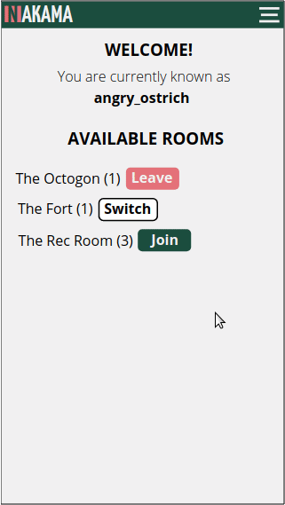
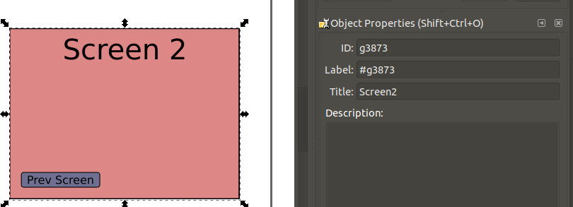
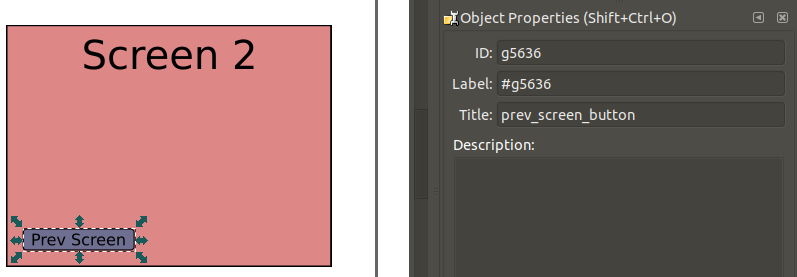
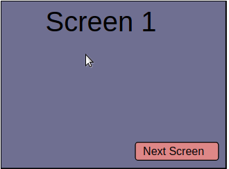
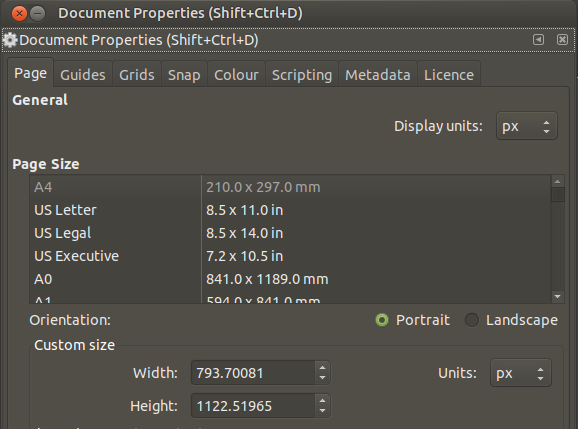

# FlUX

Create interactive UX mockups with Inkscape and JavaScript.



## Usage

Usage is inspired from the library [symbol and instance workflow](https://helpx.adobe.com/uk/animate/using/symbol-instances.html) in Adobe Animate.

Objects in Inkscape tagged with the title field exposes them to being instantiated, e.g. here, the Screen 2 rectangle is being tagged as `Screen2`.



Nested objects can subsequently be tagged as well; these can be referred to once the object is instantiated. e.g. the button within Screen 2 can be referred to as `prev_screen_button`.



Interactivity can then be added with some JavaScript:

```javascript
flux.init(document.getElementById('stage'), inkscapeSvg, function(stage, library, helpers) {
  var screen1 = library.Screen1();
  var screen2 = library.Screen2();
  
  screen1.next_screen_button.buttonMode = true;
  screen1.next_screen_button.addEventListener('click', function() {
    stage.removeChild(screen1);
    stage.addChild(screen2);
  });
  
  screen2.prev_screen_button.buttonMode = true;
  screen2.prev_screen_button.addEventListener('click', function() {
    stage.removeChild(screen2);
    stage.addChild(screen1);
  });
  
  stage.addChild(screen1);
  
  window.addEventListener('click', function() {
    helpers.showClickableAreas();
  })
}
```

`helpers.showClickableAreas()` adds [Marvel](https://marvelapp.com)-style hotspots to the clickable areas.

To produce:



There are also the following fields exposed on the `DisplayObject`:

* `_node`
* `x`
* `y`
* `width`
* `height`
* `buttonMode`
* `addEventListener`
* `addChild`
* `removeChild`

This are also the following convenience functions/objects on `helpers`:

* `showClickableAreas()`: shows which nodes have `buttonMode` set to true with hotspots
* `stageRect`: plain rect DisplayObject with stage dimensions that can be used as a backdrop for modals/dialogs by setting its `_node.style.opacity` and `_node.style.fill`

### Embedding in HTML

There is a minified drop-in version of FlUX in `bin/flux`, which can be added to your HTML files. Browse examples of how to use it in `/examples`. In order to parse the contents of the SVG, the page and assets will need to be served, which can be done with the following:
    
    npm install --production

    npm run serve-examples

### Development

Visual testing and edge cases are added as storybook components:

    npm install
    
    npm run storybook
    
To build the production FlUX package:

    npm run build

## Gotchas

### Document Properties

The viewport of the stage is set to the same dimensions as the Inkscape canvas, which should be read off the `svg` in pixel units. This can be set in Document Properties:

* Open Document properties
    * Set Custom Size on Orientation to be in pixels
    


### BBbox Computation

The Inkscape SVG needs to be visible (at least initially) in order to calculate the offsets of object groups so that they can be set to zero.

If you want to hide the Inkscape SVG, make sure to do this after instantiating FlUX, e.g. see the examples for when to do `inkscapeSvgElement.style.display = 'none'`.
